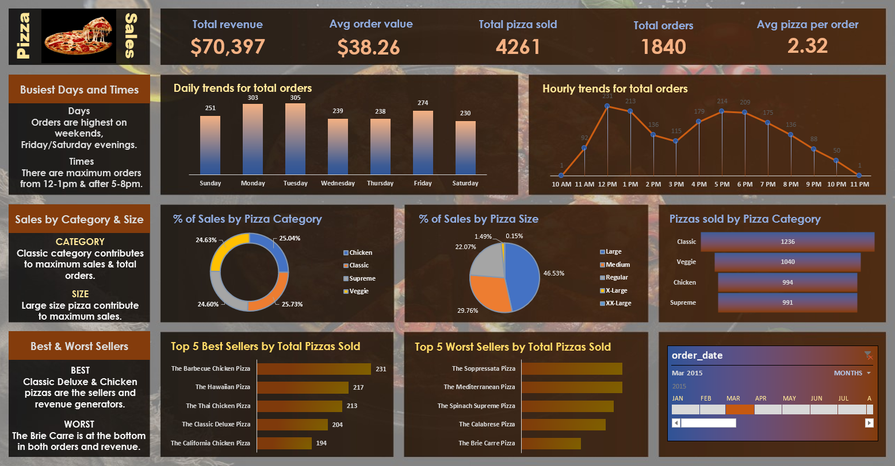

# Pizza Sales Data Analysis

An interactive pizza sales analysis project using **SQL and Microsoft Excel** to analyze revenue, order volume, product performance, customer ordering patterns, and sales trends.

## Dashboard



The Excel dashboard provides an interactive view of pizza sales using a date/month slider to explore sales performance across different time periods.

## Key Performance Indicators

| KPI                      |   Value |
| ------------------------ | ------: |
| Total Revenue            | $70,397 |
| Total Orders             |   1,840 |
| Total Pizzas Sold        |   4,261 |
| Average Order Value      |  $38.26 |
| Average Pizzas per Order |    2.32 |

## Analysis

The project analyzes:

* Daily order trends
* Hourly order patterns
* Revenue and sales performance
* Pizza category performance
* Pizza size performance
* Best-selling pizzas
* Worst-selling pizzas
* Order volume across different time periods

## Key Insights

### Ordering Patterns

Orders are highest toward the **end of the working week and weekends**, with particularly strong demand on Friday and Saturday.

Hourly analysis shows the highest order volumes around **12 PM–1 PM** and **5 PM–7 PM**, indicating strong lunch and evening demand.

### Pizza Categories

The **Classic** category contributes the highest share of pizza sales and has the highest number of pizzas sold among the four categories.

### Pizza Sizes

**Large pizzas** account for the largest proportion of sales by size, representing approximately **46.53%** of pizza sales.

### Best-Selling Pizzas

| Rank | Pizza                    | Pizzas Sold |
| ---: | ------------------------ | ----------: |
|    1 | Barbecue Chicken Pizza   |         231 |
|    2 | Hawaiian Pizza           |         217 |
|    3 | Thai Chicken Pizza       |         213 |
|    4 | Classic Deluxe Pizza     |         204 |
|    5 | California Chicken Pizza |         194 |

### Lowest-Selling Products

The analysis also identifies the lowest-performing pizzas, helping highlight products that may require promotional or menu-level review.

## 🛠️ Tools Used

* **SQL** — Data storage, querying, aggregation, and analysis
* **Microsoft Excel** — Data analysis, calculations, visualization, dashboard creation, and interactive filtering

## 📈 Excel Dashboard Features

* KPI cards for overall sales performance
* Daily order trend visualization
* Hourly order trend visualization
* Pizza category analysis
* Pizza size analysis
* Best-selling product analysis
* Worst-selling product analysis
* Interactive date/month slider

## Objective

The objective of this project was to use SQL and Excel to transform pizza sales data into an interactive business dashboard and identify actionable patterns in **sales performance, product demand, and customer ordering behavior**.

## Repository Structure

```text
Pizza-Sales-Data-Analysis/
│
├── SQL/
│   └── pizza_sales_queries.sql
│
├── Excel/
│   └── Pizza_Sales_Analysis.xlsx
│
├── Screenshots/
│   └── pizza_sales_dashboard.png
│
└── README.md
```

